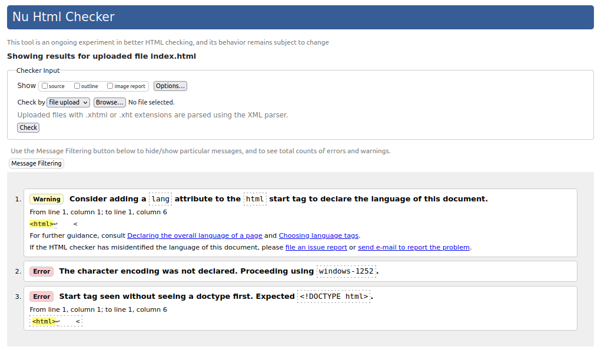

# NOTES :  (Dated:28 March 2024)
1. Reading of Article on HTML. 
2. Getting google chrome and its extensions.
3. Get a Industry Standard Code Editor ( With all the extensionns of it. )
4. Make a index.html file, naming of file is important
    * It is responsible for launching of our website.
    * 
5. Head element contains the meta data about the page which is not visible on the page.
6. Make the body element.
7. h1 heading is the biggest heading about the page (Consideringly majority times we have only one h1 heading in our page.)
8. (IP Address)127.0.0.1 (Colon): (Port Number)5500  File Name is made here!
[alt text](image.png)
9. Live Server Responses to changes we make.
10. W3C Validation Consodium. - To find out errors in web Page ( We use validation Consodium W3C )
11. 
12. We got three errors while checking the page on W3C Validation Consodium.
    * : Consider adding a lang attribute to the html start tag to declare the language of this document. ______   <html>↩
    * The character encoding was not declared. Proceeding using windows-1252.
    * Start tag seen without seeing a doctype first. Expected <!DOCTYPE html>. 
13. Now, after passing all validation checks we have
    * Document checking completed. No errors or warnings to show.
14. Adding the meta tags to HTML.
15. Alt + Z : Shortcut key for wrappinf of text If it extends the line.
16. W3C Markup Validator Used for 
17. 'href' means hypertext reference.
18. Keep on Validating the file again and again help us to overcome the umber of error we may get whle development phase.
19. 

# Resourses Used 
### If any article link is attached then it is ment for reading.
1. [HTML MDN](https://developer.mozilla.org/en-US/docs/Web/HTML)
2. Google Chrome Browser
3. Industry Standard VS Code.
4. [W3C Markup Validator]( https://validator.w3.org/ )
5. 

# Google Chrome Extensions
* Can be found at Google Web Store.
1. Dark New Tab : 
2. 

# VS Code Extension Link
1. Pretier : Code Formatter _ This code formater makes the necessary indentations in the code according to our formats. 
2. vscode-icons : Extension to add icons to the file in VS Code.
3. GitHub Theme Extension : For having dark theme on VS Code.
4. Live Server Extension _ By Ritwick Dey. (On every refresh we get our webpage updated)
5. 

# Chapter 1 - Getting Started
------------------------------
1. What is HTML?
    * HTML is short for HyperText Markup Language, and it is the language of the World Wide Web.
    * "Hypertext" refers to links that connect web pages to one another, either within a single website or between websites. Links are a fundamental aspect of the Web. 
    * HTML uses "markup" to annotate text, images, and other content for display in a Web browser. HTML markup includes special "elements" such as <head>, <title>, <body>, <header>, <footer>, <article>
    * An HTML element is set off from other text in a document by "tags", which consist of the element name surrounded by "<" and ">"

2. 
3. 

# Chapter 2 - Head Element
---------------------------
* Addint the meta tags to the H